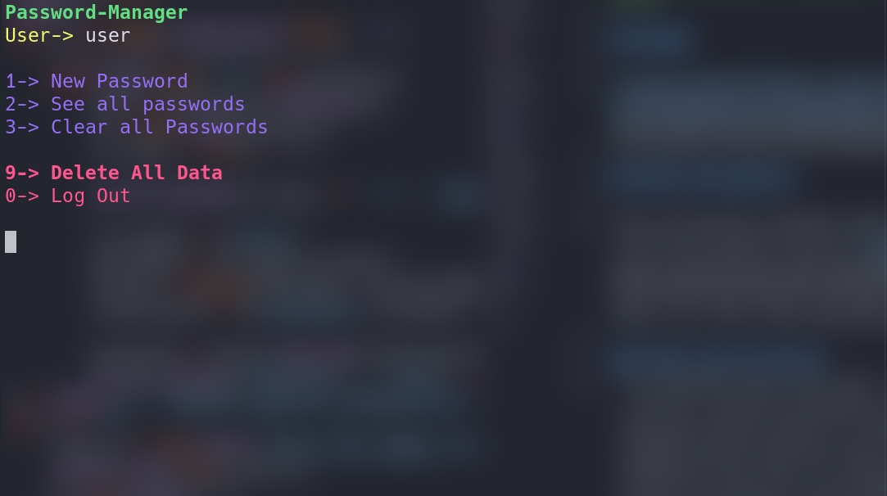

# Python Password Manager
>This is a personal project intended for learning purposes 

## Demo 

## Encryption 

The ecryptaion method comes from the libary [Fernet](https://pypi.org/project/fernet/)(symmetric encryption). It is used to store senstive data in a JSON file.

## Hash Verification

The user is prompted to create an account wich is stored in a json file where the master password is hashed using SHA256 Hash Function and salted and is verified at login. When the user is asked for the master password the two passwords are then compared to their hash values respectvily and if they match it grants  the user access to their data.

## Future changes 
* A more Object-Oriented aproch to the general functionality of the app
* A GUI with Tkinter
* Security improvements
